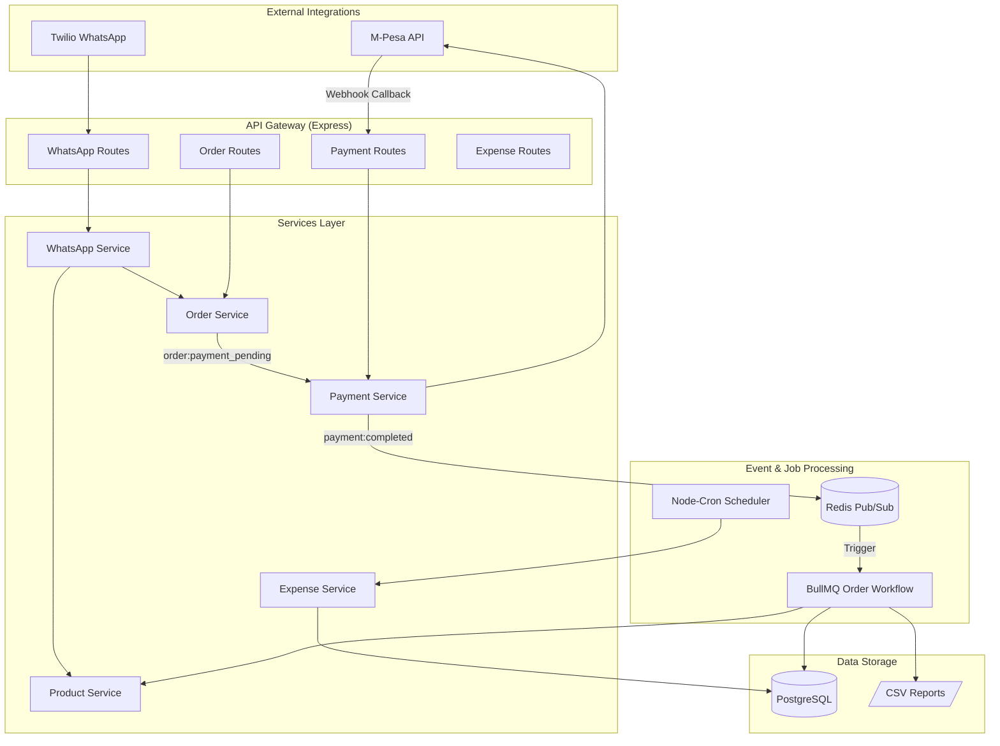
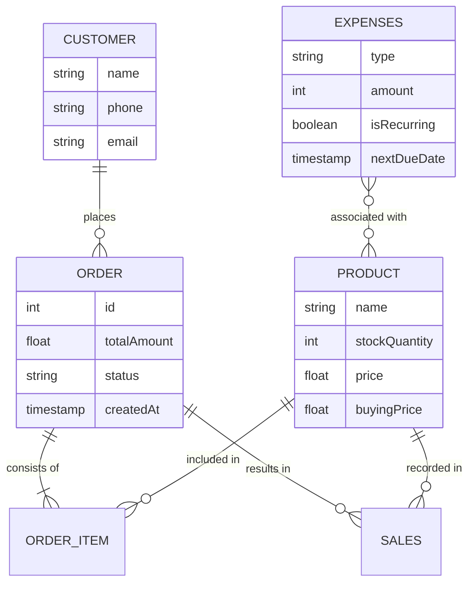

# FinAI Project Context

FinAI is a specialized backend system designed for financial and inventory management. It streamlines order processing, automated workflows, and multi-channel integrations, specifically tailored for WhatsApp order capture and M-Pesa payment processing.

---

## 1. Architecture & Tech Stack

The project utilizes a modular monolithic architecture, combining real-time API handling with robust background processing.

- **Framework**: Node.js with **Express.js** and **TypeScript**.
- **Database**: **PostgreSQL** using **Prisma ORM** for type-safe data access.
- **Worker/Job Queue**: **BullMQ** (powered by Redis) for multi-step, reliable background workflows.
- **Pub/Sub**: **Redis** for decoupled event-driven communication between modules.
- **Scheduled Tasks**: **node-cron** for recurring operations like expense management.
- **Logging**: **Winston** for structured, multi-level logging (console and file-based).
- **Process Management**: Node.js **Cluster** module for multi-core scalability and high availability.

---

## 2. Core Modules & Interrelationships

### 🛍️ Order Management
- **Endpoints**: `/api/orders`, `/api/order-items`
- **Services**: `OrderService`, `OrderItemService`
- **Logic**: Manages the lifecycle of orders. It publishes events to Redis (`order:created`, `order:payment_pending`) that other modules subscribe to. It interacts heavily with `CustomerService` and `ProductService`.

### 💳 Payment & Webhooks
- **Endpoints**: `/api/payments/initiate`, `/api/webhook/mpesa`
- **Services**: `PaymentService`
- **Logic**: Handles M-Pesa STK Push initiations. The webhook handler receives asynchronous confirmations from M-Pesa, updates the order status, and publishes `payment:completed` to trigger finalized workflows.

### 📦 Product & Inventory
- **Endpoints**: `/api/products`
- **Services**: `ProductService`
- **Logic**: Tracks stock levels, buying prices, and selling prices. It is updated by the `Order Completion Workflow` to ensure inventory reflects actual sales.

### 💬 WhatsApp Integration
- **Endpoints**: `/api/whatsapp`
- **Services**: `WhatsAppService`
- **Logic**: Acts as an entry point for orders. It parses incoming WhatsApp messages (via Twilio), creates or retrieves a `Customer`, finds the `Product`, and initiates an `Order`.

### 📉 Sales & Expense Tracking
- **Endpoints**: `/api/sales`, `/api/expenses`
- **Services**: `SalesService`, `ExpenseService`
- **Logic**: 
    - `SalesService`: Manages finalized transaction records.
    - `ExpenseService`: Tracks business costs, including recurring expenses (monthly/weekly) managed via cron jobs.

---

## 3. Key Workflows & Diagrams

### Order Completion Workflow (Background)
When a payment is confirmed (`payment:completed`), a BullMQ workflow is triggered to perform atomic, sequential operations:

1.  **Store Sale**: Persistence of sale records in PostgreSQL.
2.  **Log to CSV**: Appends sales data to product-specific CSV files for external reporting.
3.  **Update Inventory**: Deducts stock from the database.
4.  **Trend Analysis**: Logs stock level changes to inventory trend CSVs.

### System Interrelationships Map

---

## 4. Database Schema Summary

---

## 5. Endpoints Inventory

| Method | Path | Service | Description |
| :--- | :--- | :--- | :--- |
| **POST** | `/api/orders` | `OrderService` | Create a new order with items |
| **GET** | `/api/orders/:id` | `OrderService` | Retrieve order details & status |
| **POST** | `/api/payments/initiate` | `PaymentService` | Trigger M-Pesa STK Push |
| **POST** | `/api/webhook/mpesa` | `PaymentService` | Handle M-Pesa async callbacks |
| **POST** | `/api/whatsapp` | `WhatsAppService` | Ingest orders from WhatsApp |
| **POST** | `/api/products` | `ProductService` | Add items to inventory |
| **POST** | `/api/expenses` | `ExpenseService` | Log new business expense |
| **GET** | `/health` | - | Cluster-aware health monitoring |
